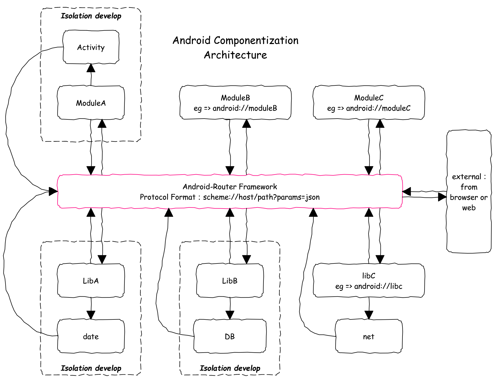

# Android-Router
[English](https://github.com/TangXiaoLv/Android-Router/blob/master/README.md) | 中文


|lib|androidrouter|androidrouter-compiler|androidrouter-annotations|
|---|---|---|---|
|version|[  ](https://bintray.com/tangxiaolv/maven/androidrouter/1.0.2/link)|[  ](https://bintray.com/tangxiaolv/maven/androidrouter-compiler/1.0.0/link)|[  ](https://bintray.com/tangxiaolv/maven/androidrouter-annotations/1.0.0/link)|
高性能，灵活，简单易用的轻量级Android组件化协议框架，用来解决复杂工程的互相依赖，解耦出的单个模块有利于独立开发和维护。

Update Log
---
```
1.0.2: 支持线程切换。
1.0.1: 性能优化。
1.0.0: 第一次推送。
```

目标
---
- 工程解耦
- 模块独立开发独立维护
- 让生活变得美好

特性
---
- 编译时处理注解生成模板代码
- 路由过程抛出的异常集中处理
- 任意参数类型回传
- 运行时动态参数类型解析，支持不同类型传值
    * From jsonObject => To Object
    * From jsonArray => To List
    * From Object A => To Object A
    * From Object A => To Object B
    * From List< A> => To Object List< B> 

组件化路由图
---



Gradle
---
```
//需要在各自的application/library 中添加依赖
//android plugin version > 2.2+
dependencies {
    compile 'com.library.tangxiaolv:androidrouter:1.0.2'
    annotationProcessor 'com.library.tangxiaolv:androidrouter-compiler:1.0.0
}

//android plugin version < 2.2
apply plugin: 'com.neenbedankt.android-apt'

buildscript {
    repositories {
        jcenter()
    }

    dependencies {
        classpath 'com.neenbedankt.gradle.plugins:android-apt:1.4'
    }
}

dependencies {
    compile 'com.library.tangxiaolv:androidrouter:1.0.2'
    apt 'com.library.tangxiaolv:androidrouter-compiler:1.0.0
}
```

快速入门
---
注：使用本框架需要遵守标准协议格式：scheme://host/path?params=json

*scheme[1] host[1] path[2] params[2] 1:必须 2:可选*

###第一步:给自定义Module配置注解协议
```java
/**
 * 支持的参数类型
 *
 * float
 * int
 * long
 * double
 * boolean
 * String
 * List<?>
 * Map<String,Object>
 * custom object
 * 
 * 默认传递Application context, String scheme, VPromise promise
 */
@RouterModule(scheme = "android", host = "main")
public class MainModule implements IRouter {

    //Route => android://main
    @RouterPath
    public void def(Application context, String scheme, VPromise promise) {
        promise.resolve("","from scheme: [" + scheme + "] " + "path: []");
    }
    
    //如果返回值不是void类型，当return时会自动调用promise返回
    @RouterPath("/autoReturn")
    public String autoReturn(String scheme) {
        return "I'm auto return!!!!! ";
    }

    //Route => android://main/activity/localActivity
    @RouterPath("/activity/localActivity")
    public void openLocalActivityAndReturnResult(Application context, VPromise promise) {
        String tag = promise.getTag();
        Intent intent = new Intent(context, LocalActivity.class);
        intent.putExtra("tag", tag);
        intent.addFlags(Intent.FLAG_ACTIVITY_NEW_TASK);
        context.startActivity(intent);
    }

    //从json object中取值
    //Route => android://main/params/basis?params={'f':1,'i':2,'l':3,'d':4,'b':true}
    @RouterPath("/params/basis")
    public void paramsBasis(float f, int i, long l, double d, boolean b,
                            String scheme, VPromise promise) {
        promise.resolve("","from scheme: [" + scheme + "] " + "path: [/params/basis]");
    }

    //从json object中取值
    //Route => android://main/params/complex?params={'b':{},'listC':[]}
    //自定义对象需要实现IRouter,并且需要空参数构造函数
    @RouterPath("/params/complex")
    public void paramsComplex(B b, List<C> listC, String scheme, VPromise promise) {
        promise.resolve("","from scheme: [" + scheme + "] " + "path: [/params/complex]");
    }

    //将json对象中的全部数据转化成自定义对象,key必须是_params_
    //自定义对象需要实现IRouter,并且需要空参数构造函数
    @RouterPath("/jsonObject")
    public void paramsPakege(Package _params_, String scheme, VPromise promise) {
        promise.resolve("","from scheme: [" + scheme + "] " + "path: [/jsonObject]");
    }

    //将json数组中的全部数据转化成List,key必须是_params_
    //自定义对象需要实现IRouter,并且需要空参数构造函数
    @RouterPath("/jsonArray")
    public void jsonArray(List<A> _params_, String scheme, VPromise promise) {
        promise.resolve("","from scheme: [" + scheme + "] " + "path: [/jsonArray]");
    }

    //eg: from A => to B
    //不同类型对象传递,对象中的基本类型参数key和类型必须一致
    //自定义对象需要实现IRouter,并且需要空参数构造函数
    @RouterPath("/differentTypes")
    public void differentTypes(A a, List<A> listA, String scheme, VPromise promise) {
        promise.resolve("","from scheme: [" + scheme + "] " + "path: [/differentTypes]");
    }

    //返回错误推荐使用RouterRemoteException
    @RouterPath("/throwError")
    public void throwError(VPromise promise) {
        promise.reject(new RouterRemoteException("I'm error................."));
    }
}

//支持接收多scheme
@RouterModule(scheme = "android|remote", host = "lib")
public class RemoteModule implements IRouter {

    @RouterPath("/openRemoteActivity")
    public void openRemoteActivity(Application context, String scheme, VPromise promise) {
        Intent intent = new Intent(context, RemoteActivity.class);
        intent.putExtra("tag", promise.getTag());
        intent.addFlags(Intent.FLAG_ACTIVITY_NEW_TASK);
        context.startActivity(intent);
    }
}
```
###第二步:调用协议
```
//任意地方调用
//方式一
AndroidRouter.open("android://main/activity/localActivity")
    .callOnSubThread()//调用在子线程
    .returnOnMainThread()//回调在主线程
    .call(new Resolve() {
        @Override
        public void call(String type, Object result) {
            //获取返回值
        }
    }, new Reject() {
        @Override
        public void call(Exception e) {
            //所有路由过程中的异常都会回调到这里
    }
});
    
//方式二
 AndroidRouter.open("android", "main", "/differentTypes")
    .showTime()//显示本次调用时间
    .call();//忽略返回值和错误
```
###混淆
```
//配置混淆
-keep class * implements com.tangxiaolv.router.interfaces.IMirror{*;}
-keep class * implements com.tangxiaolv.router.interfaces.IRouter{*;}
```

License
---
    Copyright 2017 TangXiaoLv
    
    Licensed under the Apache License, Version 2.0 (the "License");
    you may not use this file except in compliance with the License.
    You may obtain a copy of the License at
    
        http://www.apache.org/licenses/LICENSE-2.0
    
    Unless required by applicable law or agreed to in writing, software
    distributed under the License is distributed on an "AS IS" BASIS,
    WITHOUT WARRANTIES OR CONDITIONS OF ANY KIND, either express or implied.
    See the License for the specific language governing permissions and
    limitations under the License.
